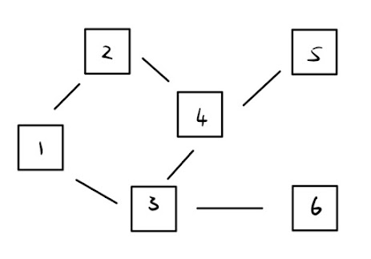
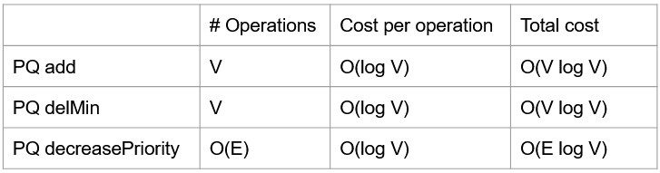
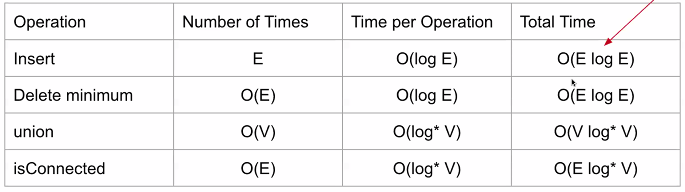
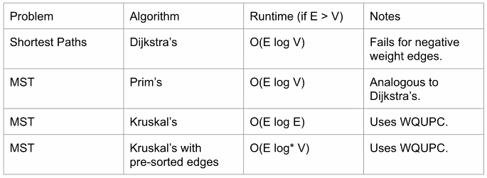

# DFS, BFS, MSTs

## Traversals

### Preorder Traversal

Equivalent to DFS preorder traversal

- visit a node, then traverse its children

> DBACFEG

### Inorder Traversal

- traverse left child, parent, traverse right child

1. start at bottom level
2. left, parent, right
3. move up

> ABCDEFG

### Postorder Traversal

- traverse left, traverse right, then visit

1. start at bottom level
2. left, right, parent
3. move to right subtree

> ACBEGFD

preorder: 1, 2, 4, 3, 6, 5  
postorder: 6, 3, 5, 4, 2, 1

### Level Order

- traverse left to right for each level

> DBFACEG

## Graphs

A set of nodes + a set of zero or more edges

- trees are graphs w/ no cucles and every vertex is connected

### Simple Graph

- no edges that connect a vertex to itself (no length 1 loops)
- no 2 edges connect to same vertices

**Path**: sequence of vertices connected by edges

- Simple path: path w/o repeated vertices

**Cycle**: path whose first and last vertices are the same

**Directed**: vertices have a edges w/ directions

**Cyclic**: term to describe a graph w/ a cycle

**Connected**: term to describe if there is a path b/w 2 vertices

## Depth First Search (DFS)

Explore neighbor's entire subgraph before moving to next neighbor

## Breadth First Search (BFS)

Explore all children before moving each children's nodes

1. start at root

## Dijkstra's Algorithm

Used to find Shortest Paths Tree (SPT)  
Visit vertices in **order of best-known distance** from source

> special case of A\* Search w/ h = 0 for all nodes
>
> Type of BFS

- for each visit, the next node the algorithm visits is the one w/ the minimum distance from the source
- doesn't work w/ negative edge weights

1. insert all vertices in fringe (dummy distance -> inf, b/c we haven't visited yet)
2. expand _top node_ -> insert all visits into fringe, ordered by path distance  
    i) only visit if **NOT** in finished stack  
   ii) If a node (already in PQ) has a shorter path, replace distance in PQ, update prev for that node
3. after fully expanding, remove expanded node from PQ (move it to finished stack), then expand into next top node
4. stop when destination node gets to top of PQ

## A\* Search

- addresses problem where dijkstra's only searches for shortest path -> "smart" paths
- small extension to dijkstra's that says "we're gonna get closer"

**Heuristic**: path distance from source + distance from destination (euclidian, manhattan, etc.)

- purpose: if a node has a longer way to go, it gets lower priority (expanded later)

1. insert all visits (from start node) in fringe, sorted by lowest heuristic
2. expand _top node_ -> insert all visits (from top node) in fringe  
   i) only visit if **NOT** in finished stack  
   ii) if total _PATH_ weight is less than _PATH_ weight in fringe for a visit, then replace that node in fringe w/ lower _PATH_ weight + heuristic (and update prev node)
3. after fully expanding, remove expanded node from PQ (move it to finished stack), then expand into next top node
4. stop when destination node gets to top of PQ

## Minimum Spanning Trees (MSTs)

### Spanning Tree

in an undirected graph, a spanning tree T is a subgraph of G, where T

- is connected
- is acyclic
- includes all vertices

### MSTs

spanning tree of **minimum total weight**

#### cut: an assignment of a graph's nodes to 2 non-empty sets

- sets don't have to be contiguous

#### crossing edge: an edge which connects a node from one set to a node from other set

#### cut property: given any cut, min weight crossing edge is in the MST

## Prim's Algorithm

store vertices in order of distance from tree

- for each visit, the next node the algorithm visits is the one w/ the minimum distance from the tree

1. repeatedly add shortest edge (mark black) that has one node inside MST under construction
2. repeat until V-1 edges

## Kruskal's Algorithm

1. consider edges in order of increasing weight
2. add edge to MST (mark black) unless creates a cycle
3. repeat until V-1 edges

## Asymptotics

