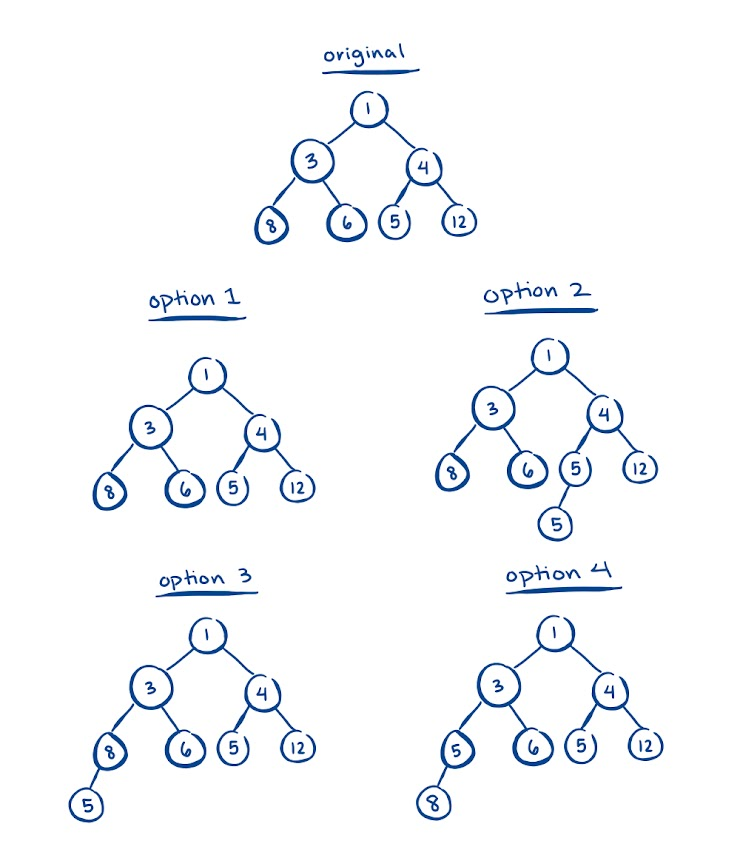

# Heaps

## MinHeaps

- root is smallest
- is a _complete_ BST
  - complete -> each level above last is full
- every child of a node is greater than or equal to parent

### add

```java
heap.add(n)
```

1. fill first open child of tree
2. if parent of n is greater than n, swap places
3. repeat (2) until fixed

add 5 -> (option 4)


### delete

1. replace root w/ last node
2. swap min child until fixed

### Heapify

Create a min heap from unsorted array

#### Heapify up

1. start at last non-leaf node
2. Bubble-up: check if parent satisfies min heap property (less than / equal to children)
3. swap with smallest child if needed

#### Heapify down

1. start at root
2. Bubble-down: check if parent satisfies min heap property (less than / equal to children)
3. swap with smallest child if needed

### indexing

if we want to find the first item at level `i`

- index `Math.pow(2, i)`

## Max Heap

- root is greatest
- is a complete binary tree
- all children are greater than or equal to parent
