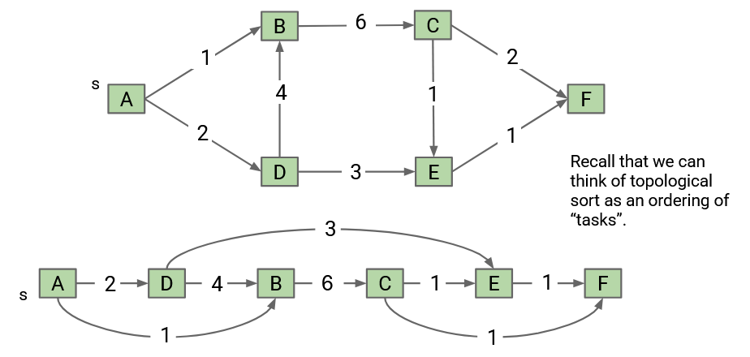
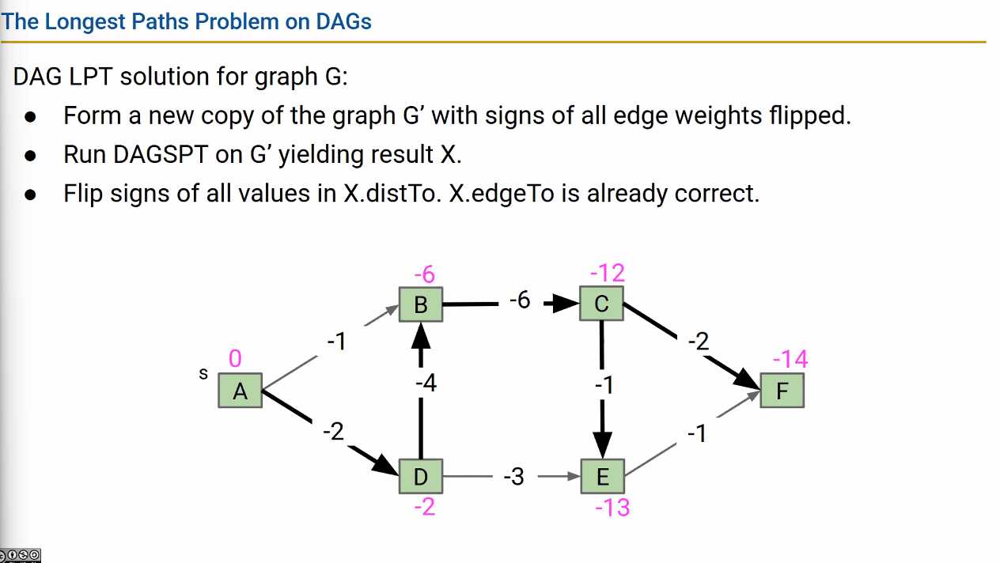
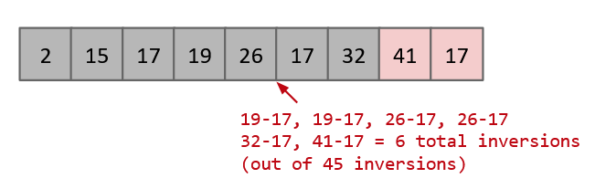
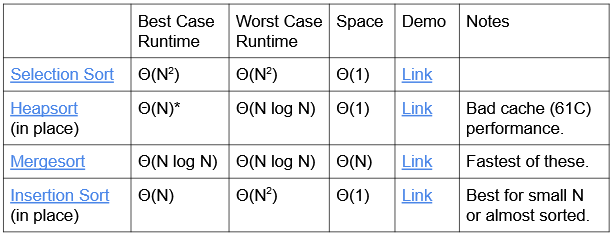

# Sorts

## Topological Sort

Perform DFS traversal from every vertex, traverse through each adjacent node, store last node into postorder

- only exists if directed, acyclic (DAG)
- sort vertices in order of edges
- nodes in the postorder should always be pointing to a node further down the list, never pointing before

Ex. excecuting all dependencies before main program

postorder: [F, E, C, B, D, A]

Topological sort: [A, D, B, C, E, F]

### asymptotics

$O(V + E)$  
$\Theta(V)$

## Longest Paths on DAGs

## Selection Sort

1. find smallest item
2. move to end
3. repeat until sorted

Runtime:

- Best case: $\Theta(N^2)$
- Worst case: $\Theta(N^2)$

Memory: $\Theta(1)$

## Heapsort

### Naive

Naive heapsorting N items:

1. place all items into maxheap, discard input array, create output array
2. repeat N times:  
   i. delete largest item from max heap
   ii. put largest item at end of unused part of output array

Runtime: $O(NlogN)$

### In-place

Heap sorting N items:

1. Bottom-up heapify input array
2. Repeat N times:  
   i. deleate largest item from max heap, swap root w/ last item in heap

Asymptotics:

- Bottom-up heapification: $O(NlogN)$
- selecting largest item: $\Theta(1)$
- removing largest item: $O(logN)$

- Runtime:

  - Best case: $\Theta(N)$, w/ array of all duplicates
  - Worst case: $\Theta(NlogN)$

- Memory: $\Theta(1)$, heap operations implemented iteratively

Notes:

- bad cache performance

## Merge Sort

1. Split items into 2 roughly even pieces
2. Mergesort each hald
3. Merge 2 sorted halves

Asymptotics:

- Runtime: Best/Worst -> $\Theta(NlogN$)
- Memory: $\Theta(N)$

Notes:

- faster than heap sort

## Insertion Sort

1. start w/ empty output sequence
2. add each item from input, inserting into output at right point

Inversion: a pair of elements that are out of order w/ respect to $\lt$

### In-place

1. Repeat for `i = 0` to `N - 1`:  
   i. Designate item i as 'travel' item  
   ii. Swap item backwards until traveler is in right place (all items to left are $\leq$)

Asymptotics:

- Runtime: $\Omega(N)$, $O(N^2)$

Notes:

- best for small arrays

## Quicksort (Partition Sort)

Partition: a rearrangement of the items, given a pivot `x`, such that:

- all entries to the left of x are $\leq$ x
- all entries to the right of x are $\geq$ x
- x moves between the smaller and larger items

Steps:

1. Partition on leftmost item (pivot at index 0)
2. quicksort left half
3. quicksort right half

Best case: pivot always lands in the middle

- such that recursive tree calls are minimized

Worst case: pivot always lands at beginning

Runtime:

- Best case: $\Theta (N log N)$
- Worst case: $\Theta (N^2)$
  - happens w/ bad ordering (array already sorted) or bad elements (array w/ all duplicates)

### Hoare Partitioning (in place)

Steps:

1. L pointer likes small items
2. G pointer likes large items
3. Walk pointers towrds each other, stopping on a "hated" item
   - when both pointers stopped, swap and move pointers by one
   - when pointers cross, you are done walking
4. Swap pivot w/ G
   Memory: $\Theta(1)$, heap operations implemented iteratively

## Radix Sort

### Least Significant Digit (LSD)

### Most Significant Digit (MSD)
