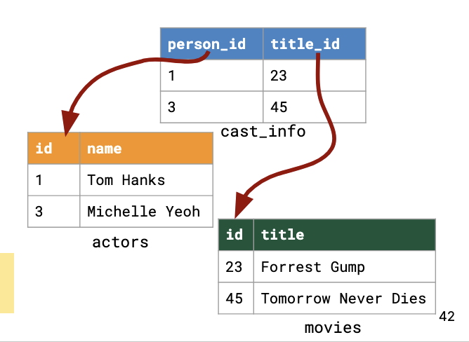
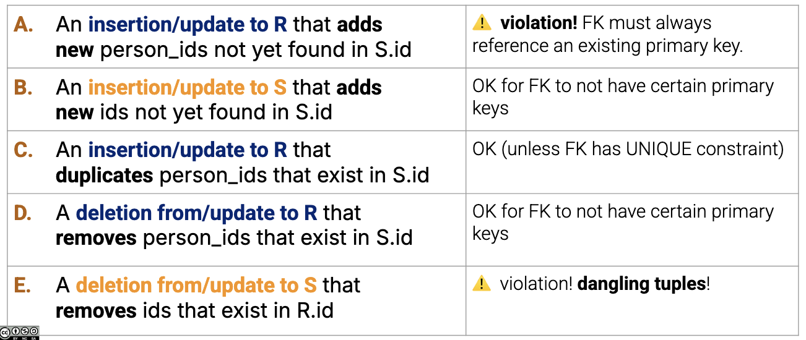

# Modifying Data

## DML (Data Manipulation Language)

A modification command doesn't return the result like a query, but changes the relational instance (stored tuples)

### `INSERT`

```sql
INSERT INTO Titles VALUES
  ('tt11737520', 'tvSeries', 'One Piece', 'One Piece',
   0, 2023, NULL, 60, 'Action,Adventure,Comedy'),
  ('tt1001526','movie', 'Megamind', 'Megamind',
   0, 2010, NULL, 95, 'Action,Adventure,Comedy');
--    Each tuple is specified by parenthesis, separated by commas
-- each insert must have all attributes, in order

INSERT INTO Titles (title_id, type, premiered, primary_title) VALUES
  ('tt11737520', 'tvSeries', 2023, 'One Piece');
--   explicitly specifies attributes to insert
-- can be out of order

```

### `DELETE`

Deletes all tuples from a table that satisfy a condition

```sql
DELETE FROM <table> WHERE <condition>;
```

### `UPDATE`

Changes certain attributes of tuples in Relation that satisfy a condition.

```sql
UPDATE <table>
  SET <list of attribute assignments>
  WHERE <condition>;

UPDATE employees
  SET salary = salary * 1.2 
  WHERE title = 'Database Designer' AND salary < 100000;
```

#### Issue with UPDATE & DELETE

- when salary is $50k, increase to $60k, but still under $100k
- query keeps updating until new salary is >= $100k

Solution

1. Phase 1: lookup each tuple that matches WHERE, mark it for update
2. Phase 2: update/delete all marked tuples

## DDL (Data Definition Language)

Designing a Schema:

- generally all `lowercase_snake_case` identifier names
- tables are plural, cols based on type
- be consistent!

Dates, Times, Timezones

- date: day w/o defined time
- time: time of day
- timestamp: date + time
  - option: add timezone

### `CREATE`

Create an empty table w/ 2 columns

```sql
CREATE TABLE zips (
    location VARCHAR(20),
    zipcode INTEGER
);
```

### `DROP`

```sql
DROP TABLE <table name>;

DROP TABLE IF EXISTS <table name>;
```

### `ALTER`

```sql
-- add new columns
ALTER TABLE Zips
    ADD area REAL,
    ADD timezone VARCHAR(5);

-- delete old columns
ALTER TABLE Zips 
    DROP area, 
    DROP timezone;
```

## Constraints

Constraints are relationships across data elements that the data system is required to preserve or enforce

- help encode domain knowledge (ex. age is between 0->120)
- act as guardrails & provide safety at cost of performance

### Keys

used to identify tuples in a relation

- Ex. CalnetID, SID
- SSN, passport number

A set of attributes is a key if no two tuples can have the same values -> **must be unique**

#### `PRIMARY KEY`

Only **ONE**

- enforces non-null

```sql
CREATE TABLE actors (
  id INTEGER,
  name TEXT,
  PRIMARY KEY (id)
);
-- id is UNIQUE
```

#### `UNIQUE`

can be multiple

- enforces attribute values to be unique throughout a relation
- does not enforce non-null

```sql
CREATE TABLE Stops (
  stop_id INTEGER,
  person_id INTEGER,
  stop_time TIMESTAMP,
  ...
  PRIMARY KEY (stop_id),
  UNIQUE (person_id, stop_time)
);
```

`NOT NULL`: value can never be NULL

`DEFAULT <value>`: if there is no specific value known, use value

#### `FOREIGN KEY`

> **Foreign Keys** are like pointers from 1 tuple to another  
> Constraint tldr: **NO NULL POINTERS**

Maintains *referential integrity* by restricting updates based on whether an attribute vvalue in one table exists in another table

- databases help manage this constraint for you
- when using `JOIN`, we most often use `FOREIGN KEY`
- like a pointer from a tuple in one table to a tuple in another
  - points to exactly **ONE TUPLE**



`REFERENCE`d attributes must be declared `UNIQUE` or `PRIMARY KEY`

```sql
CREATE TABLE cast_info (
  person_id INTEGER,
  movie_id INTEGER,
  FOREIGN KEY (person_id)
    REFERENCES actors (id),
  FOREIGN KEY (movie_id)
    REFERENCES movies (id)
);

-- less verbose
CREATE TABLE cast_info (
  person_id INTEGER,
  movie_id INTEGER,
  person_id INTEGER REFERENCES actors (id),
  movie_id INTEGER REFERENCES movies (id)
);
```



### Attribute-based Constraints

Constraint where every value in a col satisfies a Boolean expression

```sql
CREATE TABLE actors (
  id INTEGER CHECK (id >= 1000 AND id <= 9999), 
  name TEXT
); 
```