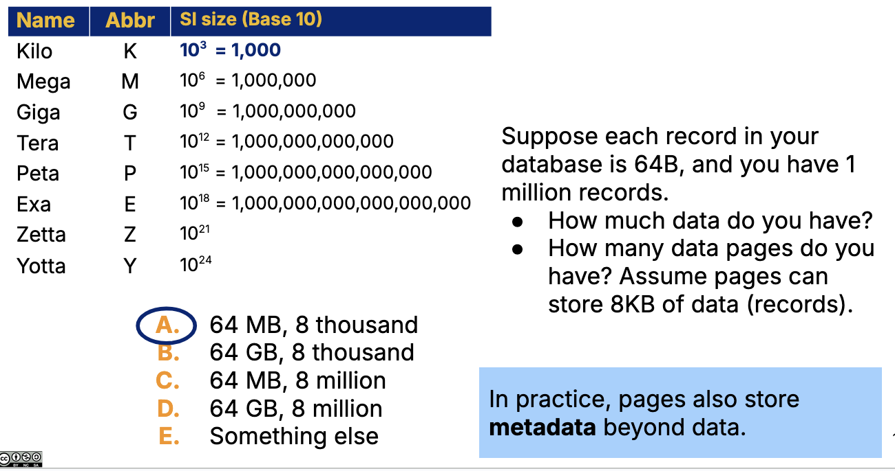

# Performance tuning & Index Selection

So far:

- SQL queries/commands
- Relational Algebra intro

Up next:

- Performance tuning queries

## Data Storage

### Pages

Data is laid out on pages (or blocks) on stable disk storage (SSD, HDD)

- page size: 8KB, usually, may habe 100s of records

## Computer Components

### CPU

runs programs

#### Main memory

often physically close to CPU, stores short-term data until CPU can operate on it

- volatile; erased when power turns off
- small buffer storage; expensive + fast
- RAM

#### Disk

often on peripheral devices; long term data

- stable, not erased when power turns off
- very large storage; cheap + slow
- SSD, HDD

To read/write any given record, the page must first be loaded from disk -> memory; for write, from memory -> disk

Memory is like a staging area

