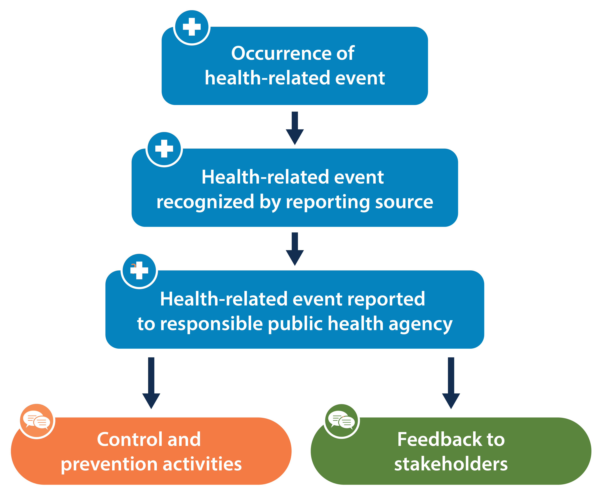

# PBHS B26 Notes

## Table of Contents

- [PBHS B26 Notes](#pbhs-b26-notes)
  - [Table of Contents](#table-of-contents)
  - [💠 Definition of Public Health](#-definition-of-public-health)
    - [The purpose of public health](#the-purpose-of-public-health)
    - [Intro to Public Health](#intro-to-public-health)
      - [Public Health Approach](#public-health-approach)
      - [Core functions of PH](#core-functions-of-ph)
      - [Health Determinants](#health-determinants)
    - [Intro to Epidemiology](#intro-to-epidemiology)
      - [Purpose](#purpose)
      - [Vocab](#vocab)
      - [Rate Formula](#rate-formula)
      - [Epidemiology Study Types](#epidemiology-study-types)
    - [Intro to Public Health Informatics](#intro-to-public-health-informatics)
      - [Steps to creating a PH Information System](#steps-to-creating-a-ph-information-system)
  - [💠 Definition of Public Health Informatics](#-definition-of-public-health-informatics)
    - [3 distinct phases](#3-distinct-phases)
      - [Age of Observation](#age-of-observation)
      - [Age of Analysis](#age-of-analysis)
      - [Modern Public Health Informatics](#modern-public-health-informatics)
    - [Birth of Biostatistics \& Epidemiology](#birth-of-biostatistics--epidemiology)
    - [Development of Federal-State PH System](#development-of-federal-state-ph-system)
      - [1st wave](#1st-wave)
      - [2nd wave](#2nd-wave)
      - [3rd wave](#3rd-wave)
    - [Terms](#terms)
  - [💠 Determinants of Health and Health Disparities](#-determinants-of-health-and-health-disparities)
    - [Social Determinants of Health (SDOH)](#social-determinants-of-health-sdoh)
      - [CDC Framework (6 pillars)](#cdc-framework-6-pillars)
      - [Healthy People 2030 SDOH](#healthy-people-2030-sdoh)
    - [Health Disparities](#health-disparities)
  - [💠 Biopsychological Basis of Public Health](#-biopsychological-basis-of-public-health)
    - [Energing infectious diseases](#energing-infectious-diseases)
    - [Reemerging diseases](#reemerging-diseases)
    - [Chronic Diseases](#chronic-diseases)
      - [Diabetes](#diabetes)
      - [Hypertension](#hypertension)
      - [Opioid Addiction](#opioid-addiction)
  - [💠 Community Organizing and Health Communication](#-community-organizing-and-health-communication)
    - [Health Communication and Health Information Technology (HC-HIT)](#health-communication-and-health-information-technology-hc-hit)
    - [Core objectives](#core-objectives)
    - [Developmental and research objectives](#developmental-and-research-objectives)
  - [💠 Public Health Institutions and Healthcare Information Systems](#-public-health-institutions-and-healthcare-information-systems)
    - [U.S. Healthcare System](#us-healthcare-system)
      - [Quality criteria](#quality-criteria)
    - [Governmental Context of PHI](#governmental-context-of-phi)
    - [PHI and Governmental Policy in USA](#phi-and-governmental-policy-in-usa)
    - [Govt Policy and Private Sector](#govt-policy-and-private-sector)
    - [Govt and Legsilative issues](#govt-and-legsilative-issues)
    - [National Agenda for Publich Health Informatics](#national-agenda-for-publich-health-informatics)
      - [Govt and legistlation: recent developments](#govt-and-legistlation-recent-developments)
    - [Public Health Informatics Infrastructure](#public-health-informatics-infrastructure)
      - [Technical structure of PH addresses 4 dimensions](#technical-structure-of-ph-addresses-4-dimensions)
      - [Examples of PHI Applications](#examples-of-phi-applications)
      - [Bidirectional Communication](#bidirectional-communication)
      - [Public Health Informaticians](#public-health-informaticians)
    - [Electronic Health Records (EHRs)](#electronic-health-records-ehrs)
      - [Benefits of Health IT](#benefits-of-health-it)
      - [Benefits of EHRs](#benefits-of-ehrs)
      - [Securing EHRs](#securing-ehrs)
  - [💠 Public Health Informatics and E-Technologies](#-public-health-informatics-and-e-technologies)
    - [Internet of Things (IoT)](#internet-of-things-iot)
      - [IoT Health Based Architecture](#iot-health-based-architecture)
  - [💠 Public Health Informatics: Analytical Methods](#-public-health-informatics-analytical-methods)
    - [Data Analytics](#data-analytics)
    - [Surveillance](#surveillance)
      - [Covid-19 Surveillance](#covid-19-surveillance)
      - [Disease Registries](#disease-registries)
    - [Peer-reviewed Literature](#peer-reviewed-literature)
      - [Benefits](#benefits)
      - [Limitations](#limitations)
    - [Finding Health Statistics](#finding-health-statistics)
  - [💠 Public Health Ethics](#-public-health-ethics)
  - [💠 Health Information Exchange (HIE)](#-health-information-exchange-hie)
    - [Benefits](#benefits-1)
    - [Directed Exchange](#directed-exchange)
    - [Query-based Exchange](#query-based-exchange)
    - [Consumer-mediated Exchange](#consumer-mediated-exchange)

## 💠 Definition of Public Health

### The purpose of public health

core functions of public health agencies:

- assessment
- policy development
- assurance

Public health must meet following intersection criteria:

- severity
- preventability
- prevalence

Focus:

- promote health of populations rather than individuals
- prevent disease and injury rather than treatment
- legislate government policy and balancing competing needs to protect public health

Big Data:

Explosion of information:

- volume, velocity, variety, value of data

---

### Intro to Public Health

> **Public Health**: the science and art of preventing disease, prolonging life, and promoting health through the organized efforts and informed choices of society, organizations, public and private communities, and individuals

#### Public Health Approach

1. Surveillance (problem)

   - what is the problem?

2. Risk Factor Identification

   - what is the cause?

3. Intervention, Evaluation

   - what works?

4. Implementation (response)
   - How do you do it?

#### Core functions of PH

- assessment -> collect, analayze, make available information on healthy communities
- policy development -> promote use of scientific knowlege base in policymaking
- assurance -> ensure provision of services to those in need

#### Health Determinants

- genes & biology
- health behaviors
- social or societal characteristics
- health services or medical care

### Intro to Epidemiology

> **Epidemiology**: study of distribution of determinants of helath-related states among specified populations and the application of that study to the control of health problems

#### Purpose

- discover agent, host, and environmental factors that affect health
- determine relative importance of causes of illness, disability, and death
- identify segments of population that have greatest risk from specific causes of ill health
- evaluate effectiveness of health programs and services improving population health

#### Vocab

- _epidemic, outbreak_: disease occurence among a population that is in excess of what is expected in a given time and place
- _cluster_: group of cases in a specific time and place that might be more than expected
- _endemic_: diesease or condition present among a population at all times
- _pandemic_: a disease or condition that spreads across regions
- _rate_: # of cases occuring during a specific period

#### Rate Formula

> $\text{Rate (\%)} = \dfrac{\text{\# of cases}}{\text{population at risk}} \times 100$

#### Epidemiology Study Types

- Experimental
- Observational
  - Descriptive -> when/where/who was affected?
  - Analytic -> how/why they were affected?

### Intro to Public Health Informatics

> **Public Health Informatics**: the systematic application of information, computer science, and technology to public health practice, research, and learning

#### Steps to creating a PH Information System

1. Vision & System Planning
2. Health Data Standards & Integration
3. Data Privacy & Security
4. Systems Design & Implementation
   - define/implement methods for PH functions, data elements, data flow, case defs, message mappings
5. Visualization, Analysis, & Reporting of Health Data

Ex. **FluView**: a weekly surveillance report on the number and density of flu cases

|                               Informatician                               |                                Information Technologist                                |
| :-----------------------------------------------------------------------: | :------------------------------------------------------------------------------------: |
|         plans functional requirements for PH information systems          | plans technology projects, milestones, develops software, maintains & operates systems |
| evaluates application & impact of information systems in a health context |                      evaluates performance of information systems                      |
|   serves as liaison b/w multiple teams, maintains health data standards   |        designs database architecture, privacy, security, and backup procedures         |

---

## 💠 Definition of Public Health Informatics

> **Data**: used to designate a characteristic that are the focus of a public health information system  
> **Information**: refers to data placed in context w/ analysis and interpretation of data

### 3 distinct phases

#### Age of Observation

- 1st phase in PH practice
- Physicians in China, Egypt, India, Greece, Rome would simply observe patients -> provided foundation for prevention and curative practices
- Hippocrates -> one of most famous pre-computer physicians -> used observation to understand relationship of health living conditions
- observations led to development of PH interventions

#### Age of Analysis

- dark ages led to scientific isolation of Europe from Africa/Asia
- new inventions introduced to Europe from colonization lef to Eurocentric New World scientific community
- Events in this age greatly influenced PH practice:
  - bubonic plague (1347)
  - renaissance era

#### Modern Public Health Informatics

- cholera epidemics (john snow) in England (1831 - 1832) highlighted impact of poor sanitation on health
- Dr. Edwin Chadwick created Bureau of Medical Statistics
- Dr. William Farr (worked under Chadwick)
  - analyzed births and deaths information (earliest uses of PH information)
  - Farr's analysis is one of earliest examples of presentation of plausible epidemiological theory to fit collected data

### Birth of Biostatistics & Epidemiology

- Florence Nightingale worked w/ Dr. Farr to confirm connection b/w poor sanitation and mortality among British Army
- Adolphe Quetelet used statistics to analyze community health data -> foundation of Biostatistics
- John Snow's investigative analysis on Cholara outbreak -> modern epidemiology

| Year | Event                                                                                                                      |
| ---- | -------------------------------------------------------------------------------------------------------------------------- |
| 1798 | first local health dept in baltimore, MD                                                                                   |
| 1850 | census data includes gross death & birth rates                                                                             |
| 1850 | Lemuel Shattuck's Report of Sanitary Commission Massachusetts provides blueprint for PH system in U.S.                     |
| 1900 | USA has many state & local health depts tasked w/ collecting/analyzing reports on communicable diseases & vital statistics |
| 1933 | Texas becomes first state to begin reporting vital statistics to govt                                                      |

### Development of Federal-State PH System

#### 1st wave

- federal & state develop PH information systems independently, leading to different data collection & analysis methods
- federal govt imposed methods on states -> poor communication

#### 2nd wave

- federal funding of state/local PH information systems
- states want to build more integreated information systems w/ federal funding
- led to development of viable information systems for individual states

#### 3rd wave

- system developemnt began to use object-oriented software & web-enabled environments
- fedaral funds allow states to develop PH information prototype systems & make modifications
- at federal level, CDC plays a leading role in sharing/exchange data & information electronically across orgs

> **Informatics**: the field concerned w/ the optimal use of informatio noften aided by use of technology, to improve individual heealth, health care, public health, & biomedical research
>
> - contributes to improved health, improved health care, and reduced health care costs

### Terms

- _Electronic Medical Record (EMR)_

- _Evidence Based Medicine (EBM) or Practice (EBP)_

- _Comparative Effectiveness Research (CER)_: research that compares one or more diagnostic or treatment options to evaluate effectiveness, safety, and outcomes

## 💠 Determinants of Health and Health Disparities

### Social Determinants of Health (SDOH)

#### CDC Framework (6 pillars)

1. **Data & surveillance**: embed a consistend SDOH approach to standardization, collection, analysis, and dissemination of data across the agency
2. **Evaluation & evidence building**: advance evaluation and build evidence for strategies that address SDOH to reduce disparities and promote health equity
3. **Partnerships & collaboration**: establish criteria, actionable steps, and strategies for partnerships, collaborations, and relationships that result in improved health outcomes over the long term
4. **Community engagement**: foster meaningful, sustained community engagement across all phases of CDC intervention planning and implementation
5. **Infrastructure & capacity**: strengthen and sustain infrastructure such as workforce, training, and access to financial resources required to address SDOH and reduce health disparities
6. **Policy & law**: identify evidence, tools, and resources to enhance communication about policies that affect SDOH with policy makers and other stakeholders

#### Healthy People 2030 SDOH

1. Economic Stability
2. Education Access & Quality
3. Health Care Access & Quality
4. Neighborhood & Built Environment
5. Social & Community Context

Examples:

- safe housing, transportation, neighborhoods
- education, job opportunities, income
- polluted air and water
- discrimiation and violence
- language and literary skills

### Health Disparities

> **Health Disparities**: differences in the incidence, prevalence, and mortality of a disease and the related adverse health conditions that exist among specific population groups.  
> **Health Equity**: the opportunity for all people to be able to attain their highest level of health regardless of where they live or their personal stories

May occur by gender, race or ethnicity, education, income, disability, geographic location, and sexual oriantation

| Ethnic group      | Proportion of U.S. Population | HIV (out of 37,968) | Chlamydia (cases per 100k) | Gonorrhea              | Primary & Secondary Syphilis | Congenital Syphilis    | Viral Hepatitis      | TB  |
| ----------------- | ----------------------------- | ------------------- | -------------------------- | ---------------------- | ---------------------------- | ---------------------- | -------------------- | --- |
| African Americans | 13%                           | 42%                 | 1,192                      | 7.7x rate among Whites | 34.7%                        | 6.4x rate among Whites | -                    | 20% |
| Hispanics/Latinos | 19%                           | 27%                 | 392.6                      | 1.6x rate among Whites | 23.3%                        | 3.3x rate among Whites | 0.28 deaths per 100k | 29% |
| Asians            | 6%                            | 2%                  | 132.1                      | 0.5x rate among Whites | 0.8x rate among Whites       | 0.7x rate among Whites | 46.1%                | 35% |

> All statistics from this table are from 2018

## 💠 Biopsychological Basis of Public Health

### Energing infectious diseases

> Definition:  
> (1) outbreaks of new diseases that were unknown before  
> (2) known diseases that are now spreading quickly in number of cases, or in number of areas where people are sick  
> (3) known infectious diseases that are persistend and can't be controlled

Examples:

- coronavirus infections (COVID-19, SARS, MERS)
- HIV infections
- Lyme disease
- E. coli

Population at risk:

- traveling to other countries at risk w/ infectious diseases
- travelers who get ill in a country where treatment for those diseases may be limited

Causes for rise of travel-related infectious diseases:

- more global travel leads to non-U.S. infectious diseases come bacck and infect more people in the U.S.
- more people now take trips to remote parts of the world which often have health problems not common in U.S. or lack of healthcare services
- lack of knowledge of health risks

How to reduce risk of infectious disease:

- get travel health information far in advance
- see a travel medicine specialist or healthcare provider who knows the area
- up-to-date vaccines
- first aid kit
- use ppe's
- do research
- if illness symptoms, stay home

### Reemerging diseases

> Definition: diseases that come back after they have been on a major decline  
> Causes: problems in public health actions, new strains of known diseases, people's behavior causes diseases to reemerge

Examples:

- malaria
- tuberculosis
- cholera
- influenza

### Chronic Diseases

- CDC reports that chronic diseases account for 7 out of 10 causes of death in U.S. and consume 86% of nation's annual healthcare spending
- close association b/w chronic disease and patients' SDOH
- increasing prevalence and rising costs of conditions make chronic disease management one of healthcare's most challenging endeavors

#### Diabetes

- 29 million Americans are currently living w/ diaabetes (CDC)
- 84 million are prediabetic, and more may be undiagnosed and untreated
- accounts for 20% of healthcare spending
- medication non-adherence leads to additional complications for diabetic patients
- in 2016 report, neatly half of Medicare diabetic parients are unable to keep up with medication adherence due to limited finances, language barriers, and insufficient care access
- mHealth communications help patients stay on track with managing diabetes by reminding patients about upcoming appointments, regulating lifestyle choices, and tracking blood sugar testing

#### Hypertension

- 1 in 3 American adults has hypertension
- hypertension is positively linked to other CV conditions such as heart disease and stroke
- most commonly seen in non-Hispanic black males, who are 2x as likely to die from condition vs whites
- Healthcare organizations can use clinical analytics and EHR to create a registry of hight-risk individuals who may benefit from lifestyle changes and develop algorithms to determine best treament methods

#### Opioid Addiction

- one of nation's biggest health crises
- providers can use state Prescription Drug Monitoring Program (PDMP) to determine abuse
- opioid abuse is tied to social and economic circumstances
  - those suffering from addicion often have deeply rooted social or mental health problems
- Pennsylvania’s Opioid Data Dashboard helps build predictive analytics
  models to deliver a comprehensive picture of the epidemic in Pennsylvania

## 💠 Community Organizing and Health Communication

### Health Communication and Health Information Technology (HC-HIT)

- 19 objectives
- gaps exist w/ health information sources and public access and understanding
  - caused by complexity of health information, location, accessibility, and lack of social support
- health communication strategies and technoloy impact health outcomes, quality of care, and health equity

### Core objectives

- communication b/w health care providers and their patients
- patients' understanding of their own health information
- shared decision-making
- access to health information
- use of social support networks

### Developmental and research objectives

- Social marketing by state health departments
- Completeness, actionability, and engagement of crisis and emergency risk messages
- Interoperability of health information systems
- Communication with adults with limited English proficiency
- Health literacy of the population

> **Personal health literacy**: the degree to which individuals have the ability to find, understand, and use information and services to inform health-related decisions and actions for themselves and others.  
> **Organizational health literacy**: the degree to which organizations equitably enable individuals to find, undesrtand, and use information and services to inform health-realted decisions and actions for themselves and others

## 💠 Public Health Institutions and Healthcare Information Systems

### U.S. Healthcare System

#### Quality criteria

- expenditure
- quality
- availability
- population's health
- upfront cost

around 650k medical bankruptcies every year

### Governmental Context of PHI

- Public Health Informatics (PHI) describes the intersection of public health and technology w/ a focus on primary health and prevention
- Events of 9/11 and anthrax attacks created sense of urgency for comprehensive PHI capable of handling catastrophic events
- in 2002, congress made $1.1 bilion alocation to enhanve PHI

### PHI and Governmental Policy in USA

- fundamental purpose of govt is to act in public interest and provide for public good
- public health law includes a federal system and 50 separate legal systems
- Legislative branch: legislation starts with an individual member either from house or senate introducing a bill
- Executive branch headed by president oversees cabinet-level departments including Health and Human Services (HHS):
  - Vertarns Health Administration
  - Agency for Healthcare Research and Quality
  - CDC
  - The Centers of Medicare and Medicaid Services
  - The National Institutes of Health

### Govt Policy and Private Sector

- National Committee on Vital and Health Statistics: an advisory board to Secretary of Health and Human Services
  - recommendations on health information, infrastructure, and informatics
- Institute of Medicine, part of National Academy of Sciences
  - advises congress and executive branch on PH infrastructure, quality, and patient safety
- Commission on Systemic Interoperability, created by ACA to address complex technical and policy issues

### Govt and Legsilative issues

- **Health Insurance Portability and Accountability Act (HIPAA)** of 1996
  - purpose was to ensure insurance coverage after elaving employer
  - standardization of health data, so they coudl be exchanged electronically
  - regulations to protect privacy of personal health information (PHI)
- Centers for Disease Control and Prevention (CDC), late 1990's
  - launched National Electronic Disease Surveilance System (NEDSS) which allowed web-based transfer and integration of public health data at federal, state, and local levels
  - launched Health Alert Network (HAN), a communication, information and training system. Early warnings agasint bioterroism and PH threats

### National Agenda for Publich Health Informatics

- first national agenda for PHI was developed adt American Medical Informatics Association (AMIA) of 2001
  - provided recommendations for PHI
- Offirce of National Coordinator for Health Information Technology created by executive order in 2004
- Example of HIT in practice: Katrina disaster of 2005
  - lost records had an electronic footprint -> patient medical information could still be retrieved

#### Govt and legistlation: recent developments

- Health Information technology for Economic and Clinical Health (HITECH) act of 2009 funded by $2 billion investment
- Funds help federal, state, and local agencies to adopt Health IT: more electronic medical records, electronic registries, electronic data for immunizations

### Public Health Informatics Infrastructure

- Organizations - government and non-government entities
- Information and Communication Technologies - hardware, software systems
- People - the public health workforce

#### Technical structure of PH addresses 4 dimensions

1. who received health services
2. who provided health services
3. where were the health services received
4. what specific care was provided

#### Examples of PHI Applications

- immunization records
- electronic lab reporting
- syndromic surveillance

#### Bidirectional Communication

- infrastructure needs to be set up to receive datya from healthcare information systems and deliver information to clinical systems
- Bidirectional communication includes:
  - public health alerts
  - population statistics
  - person specific case management

#### Public Health Informaticians

- help organizations design, manage, and evalutate information systems and work processes
- Chief Public Health Informatics Officer: bridges gap b/w PH program areas, information systems departments, and other senior officials
- epidemiologists can be trained as PH informmaticians
- "Faculty in public health schools with either need to create informatic concentrations...within epidemiology degree programs or may need to collaborate with schools of information, computing or informatics to offer joint majors in public health informatics"

### Electronic Health Records (EHRs)

> **EHRs**: real-time patient-centered records. They contain information from all the clinicians involved in a patient's care and share information with other health care providers.  
> **EMRs**: digital versions of paper charts in clinician offices, clinics, and hospitals that are used by providers for diagnosis and treatment

- real-time, patient-centered records
- congregate information available instantly, anywhere
  - contain information about a patient's medical history (ex. diagnoses, medications, immunization dates, allergies, radiology images, lab/test results)
  - offer access to evidence-based tools that providers use in patient care decision making
  - automate and streamline providers' workflow
  - increase organization and accuracy of patient information
  - support key market changes in payer requirements and consumer expectations
- **KEY FEATURE**: can be created, managed, and consulted by authorized provers and staff across different health care orgs

#### Benefits of Health IT

- reduce your paperwork
  - EHRs record all your past and present information electronically in a centralized record
- gets your information accurately to the people who need it
- helps doctors coordinate patient care and safety
  - EHRs can warn if a prescribed drug can cause a harmful reaction with another drug
- reduce unnecessary tests and procedures
  - elimates need to perform medical tests multiple times because results are already available in a record
- gives the patient direct access to their health records
  - federally guaranteed to have access to your health records

#### Benefits of EHRs

- reduced transcription costs
- reducted chart pull, storage, re-filling costs
- improved documentation and automation
- reduced medical errors
- improved patient health/quality of care
- more efficient practices
  - integrated scheduling system that links appointments directly to progress notes
  - saves time with easier centralized chart management and queries
  - enhanced communication w/ other clinicians, labs, and health plans
- saves time and money
  - enhanced ability to meet important regulation requirements
  - reduces time and resources needed to manually charge for medical visits and prescriptions
  - alerts physicians if a test can be performed at a certain frequency
  - prompts providers to obtain Advance Beneficiary Notice, minimizing claim denials and lost charges related to Medicare w/o Advance Beneficiary Notice

#### Securing EHRs

- "Access control" tools like passwords and PIN numbers
- "Encrypting" your stored information by requiring a decryption key for access
- "Audit trail" feature that records who accessed your information

## 💠 Public Health Informatics and E-Technologies

According to CDC, internet and social media can influence health behavior:

- provides timely, credible health information and advice
- provides awareness of health care services
- reaches broader, more diverse audience
- provides tailored publich health messages
- provides interactive communication, connections, and public engagement
- empowers patients to make safer, healthier decisions

Federal Emergency Management Agency (FEMA) and American Red Cross suggests that the public use social media during and after emergencies:

- to obtain current information
- to share information such as reporting emergencies

### Internet of Things (IoT)

> **Internet of Things (IoT)**: a system of wireless, interrelated, and connected digital devices that collect, send, and store data over a network without requiring human-to-human or human-to-computer interaction

Benefits:

- streamlining and enhancing health care delivery to proactively predict health issues and diagnose, treat, and monitor patients

#### IoT Health Based Architecture

- Perception layer:
  - sensing systems that collect data (ex. radio frequency identification, infrared sensors, camera, GPS, medical sensors)
- Network layer:
  - includes wired and wirelss networks, which can communicate and store communications, 4G and 5G netwoks; potential to provide reliable conection to thousands of devices at the same time
- Application layer:
  - interprets and applies data and is responsible for delivering application-soecific services to the user. (ex. AI reading EMR data to generate diagnosis and treatment options)

## 💠 Public Health Informatics: Analytical Methods

### Data Analytics

1. Improves patient care:
   1. predictive analytics, personalized medicine, improved diagnosis, optimized treatment plans
2. Enhances operational efficiency
   1. resource allocation, cost reduction, streamlined operations, predicts outbreaks
3. Supports research and development
   1. accelrates drug discoery, analyzes clinical trial data, advances medical knowledge
4. Other applications
   1. telemedicine, public health, market research

### Surveillance

> **Public Health Survellance**: the "ongoing systematic collection, analysis, and interpretation of data, closely integrated with the timely dissemination of these data to those responsible for preventing and controlling disease and injury"

Surveillance activities are usualyl associated with the study of infectious diseases.

- the CDC, WHO, and other institutions operate databases and automated electronic reporting systems to track and monitor outbreaks of diseases
  - Ex. the National Notifiable Disease Surveillance System (NNDSS), a part of CDC -> functions through efforts of local and state health depts

#### Covid-19 Surveillance

The CDC created several surveillance systems:

- **COVID Data Tracker**: A daily update of the number of cases, deaths, hospitalizations, and vaccinations at the national, state, and county level. This information includes both new events and the total.
- **COVID Wastewater Surveillance**: Monitors the presence of the virus in the wastewater in counties.
- **Seroprevalence of COVID-19**: Monitors how much of the population has been infected with the virus.
- **COVID-19 Variants & Genomic Surveillance**: The data included show the proportion of the virus variants globally, nationally, and regionally as well as the genomic sequences that are available.

#### Disease Registries

> **Registries**: systems that allow people to collect, store retriece, analyze, and disseminate information about people with a specific disease or condition

- are another type of public health surveillance
- allows researchers to estimate how large a health problem is, determine incidience of disease, study trends over time, and evaluate effects of certain environmental exposures
- kept by govts, hospitals, universities, nonprofits, and private groups

Several types of disease registries:

- **United States Renal Data System**: Collects information on chronic kidney disease and end-stage renal disease.
- **Cystic Fibrosis Foundation Patient Registry**: Collects health information on patients with cystic fibrosis who receive care in a Cystic Fibrosis Foundation accredited facility.
- **National Amyotrophic Lateral Sclerosis (ALS) Registry**: Collects information on ALS (Lou Gehrig’s Disease) patients.

Steps in a surveillance system:

### Peer-reviewed Literature

> **Peer-reviewed journal articles**: articles that have gone through an evaluation process in which journal editors and other expert scholars critically assess the quality and scientific merit of the article and its research

#### Benefits

- ensures that the quality of thte research and validity of the findings are high
- information is available on highly detailed subject matter and complex analyses
- is easy to search through millions of articles via online databases

#### Limitations

- highly detailed and complex analyses may be irrelevant for useres who want a simple search o descriptive statistics and basic measures of public health
- may require a subscription to journals or databases
- may be prone to publication bias due to studies that report significant statistical results are published in favor of those that yield negative or null results

### Finding Health Statistics

1. Identify the type of tdata you need to answer your research question
2. What is the geographic scope of your data needs?
3. Identify one or more organizations oragencies that are likely to collect or share the information you are interested in
4. Look for a tab or link that says Data, Statistics, Research, etc. on the organization's homepage
5. Identify a specific resource that answers your research needs

## 💠 Public Health Ethics

> **Public Health Ethics Definition**
>
> As a field of study: PH ethics seeks to understand and clarify principles and values which guide public health actions
>
> - since PH actions are often undertaken by govts and are directed at the population level, principles and values can differ that those which guide actions in a biology and clinical medicine context
>
> As a field of practice: PH ethics is the application of relevbat principles and balues to public health decision making

PH ethics inquiry carries out three core functions:

1. Identifying and clarifying the ethical dilemma posed
2. Analyzing it in tterms of alternative courses of action and their consequences
3. Resolving the dilemma by deciding which course of action best incorporates and balances the guiding principles and values

Goals and strucure of PH ethics at CDC:

- support and develop ethical practices
- raises staff awareess of PH ethics
- provides support for analyzing ethical issues

## 💠 Health Information Exchange (HIE)

> **Health Information Exchange (HIE)**: allows health care professionals and patients to appropriately access and securely share a patient's medical information electronically

### Benefits

- avoid readmissions
- avoid medication errors
- improve diagnoses
- decrease duplicate testing

3 forms of HIEs:

- Directed Exchange: ability to send and receive secure information electronically between care providers to support coordinated care
- Query-based Exchange: ability for providers to find and/or request information on a patient from other providers, often used for unplanned care
- Consumer Mediated Exchange: ability for patients to aggregate and control the use of their health information among providers

### Directed Exchange

Used by providers to easily and securely send patient information, such as lab orders and results, patient referrals, or discharge summaries directly to another health care professional

- is direct to another specialist

### Query-based Exchange

Used by providers to search and discover accessible clinical sources on a patient

- often used when delivering unplanned care
  - emergency room physicians who can utilize QBE to access patient information
  - during a pregnancy to obtain pregnancy care record

### Consumer-mediated Exchange

Provides patientst with access to their health information by

- providing providers w/ their health information
- identifying and correcting wrong or missing health information
- identifying and correcting incorrect billing informaiton
- tracking and monitoring their own health